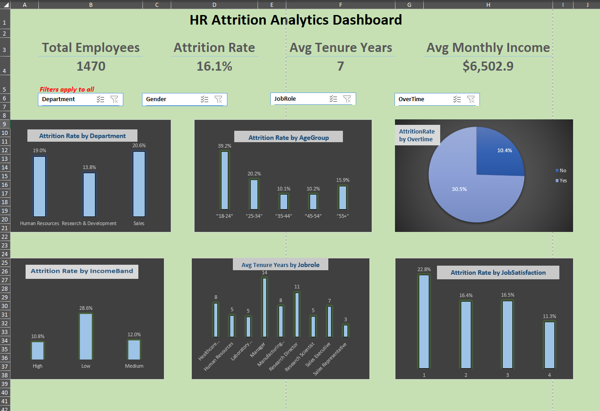

# HR Attrition Analytics Dashboard

## 📊 Problem Statement
Employee attrition is a costly problem for any organization — lost productivity, recruitment overhead, and knowledge drain. This project analyzes IBM's HR dataset to identify **which employee segments are at the highest risk of leaving** and **what factors are driving attrition**, so HR teams can act on targeted retention strategies instead of guessing.

## 📁 Dataset
**IBM HR Analytics Employee Attrition & Performance** — 1,470 employee records, sourced from Kaggle.

## 🛠️ Tools Used
- Microsoft Excel
- Power Query (data cleaning & transformation)
- Power Pivot & Data Model
- DAX (custom measures)
- PivotTables & PivotCharts
- Slicers (interactive filtering)

## 🔍 Approach
1. **Data Cleaning** — Imported the raw CSV via Power Query, removed constant/redundant columns (`EmployeeCount`, `StandardHours`, `Over18`), verified data types, and created custom `AgeGroup` and `IncomeBand` segments for deeper analysis.
2. **DAX Measures** — Built core measures in Power Pivot: `Total Employees`, `Attrition Count`, `Attrition Rate`, `Avg Monthly Income`, `Avg Tenure Years`.
3. **Analysis** — Built 6 PivotTable/PivotChart breakdowns of attrition across Department, Age Group, OverTime status, Job Role, Income Band, and Job Satisfaction.
4. **Dashboard** — Combined KPI cards, charts, and interactive slicers (Department, Gender, OverTime, Job Role) into a single-page, fully interactive dashboard.

## 📈 Key Metrics (KPIs)
| Metric | Value |
|---|---|
| Total Employees | 1,470 |
| Overall Attrition Rate | 16.1% |
| Avg Tenure | 7 years |
| Avg Monthly Income | $6,502.9 |

## 💡 Key Insights
- **OverTime is the strongest attrition driver**: employees working overtime show a **30.5%** attrition rate vs. just **10.4%** for those who don't — nearly **3x higher**.
- **Younger employees leave the most**: the 18–24 age group has a **39.2%** attrition rate, dropping to ~10% for 35–54 year-olds, before rising again to 15.9% for 55+.
- **Compensation matters**: employees in the Low income band show a **28.6%** attrition rate — more than double the Medium band (12.0%) and nearly 3x the High band (10.8%).
- **Job satisfaction is inversely linked to attrition**: employees rating satisfaction at 1 (lowest) show **22.8%** attrition, vs. just **11.3%** for those rating it 4 (highest).
- **Sales has the highest departmental attrition** at **20.6%**, followed by HR (19.0%), while R&D is comparatively stable at 13.8%.
- **Tenure varies sharply by role**: Managers average **14 years** of tenure while Sales Representatives average just **3 years**, suggesting entry-level sales roles may need stronger retention focus.

## 🖼️ Dashboard Preview

## 📂 Files in this Repo
- `HR_Attrition_Dashboard.xlsx` — full interactive Excel dashboard
- `dashboard_screenshot.png` — static preview image
- `README.md` — this file

## 🚀 How to Use
1. Download `HR_Attrition_Dashboard.xlsx`
2. Open in Excel (requires Data Model / Power Pivot support — Excel 2016+ or Microsoft 365)
3. Use the slicers at the top to filter by Department, Gender, OverTime, or Job Role — all charts update live

## 👤 About
Built by **Gulshan Mehra** as part of a data analytics portfolio, focused on Excel, Power Query, Power Pivot, and DAX.
